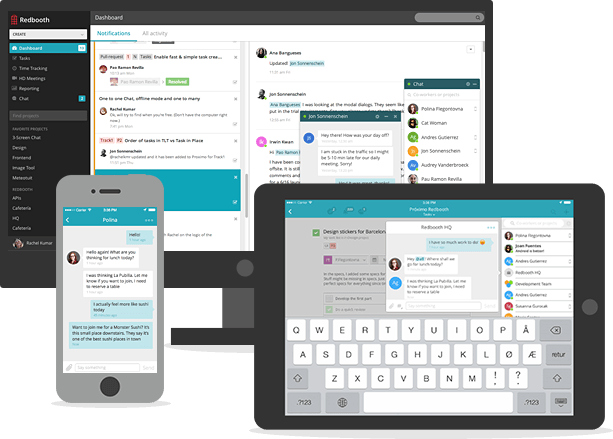
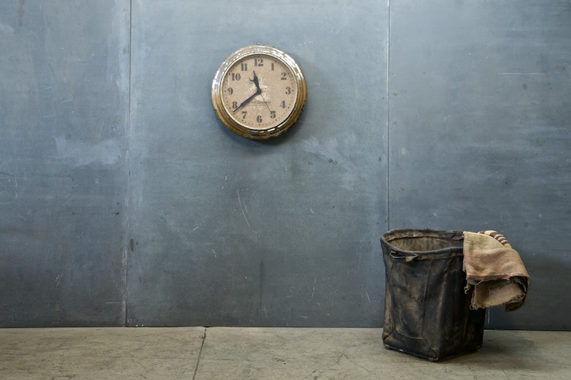
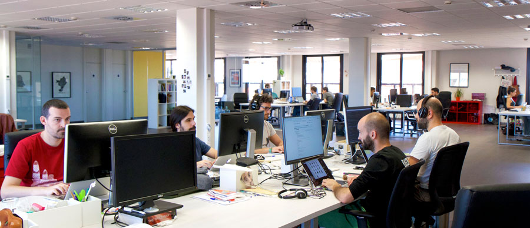
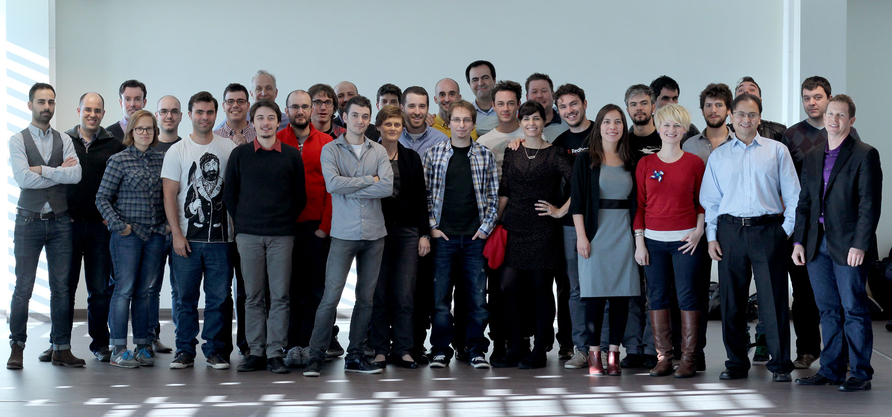
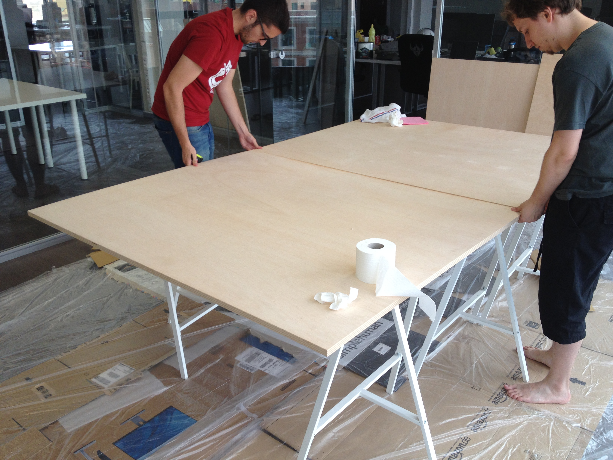
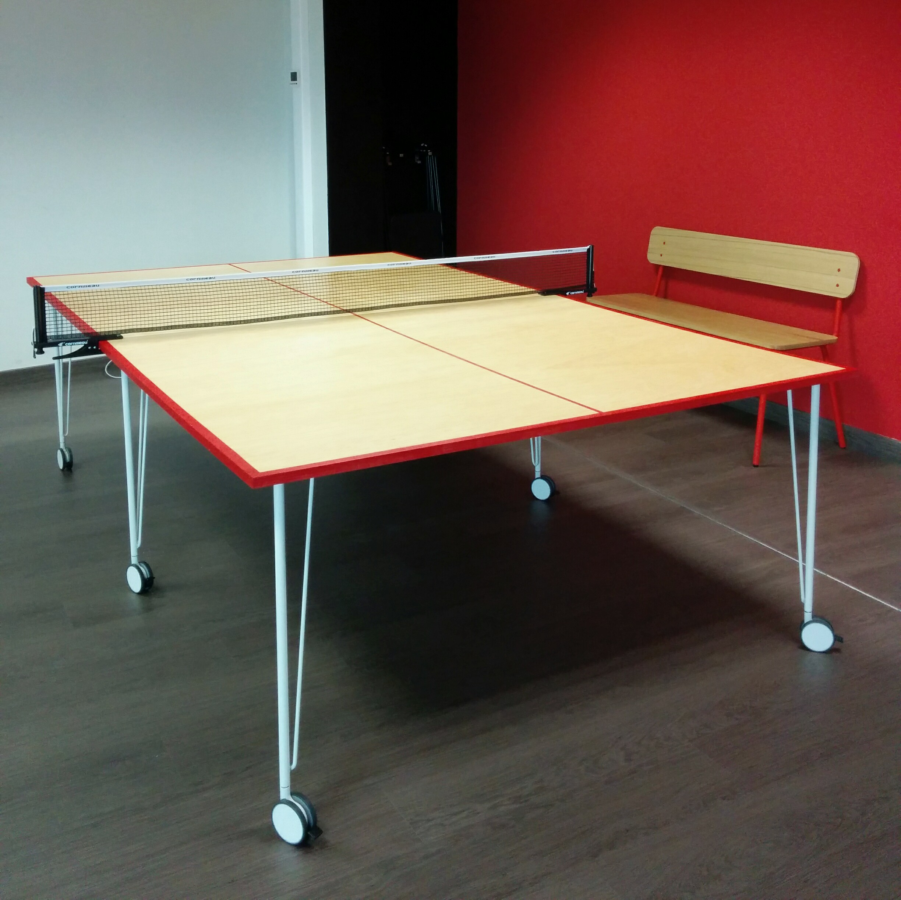
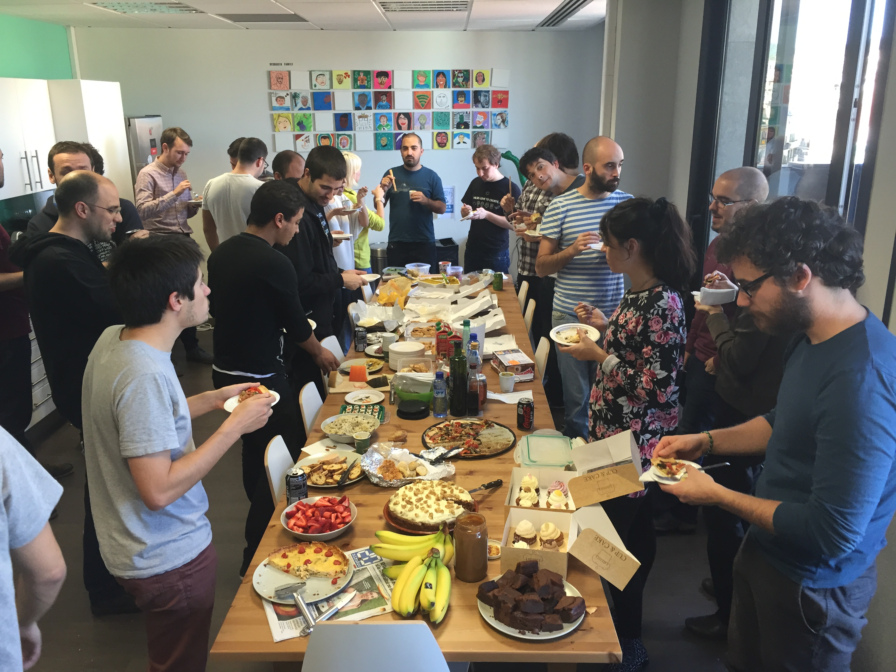
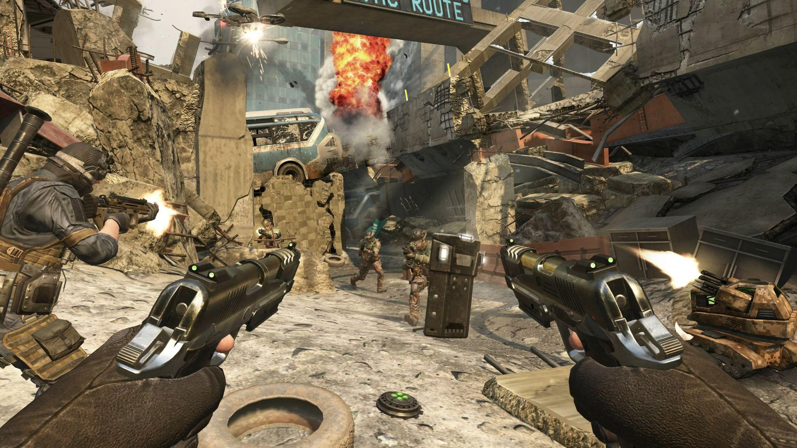
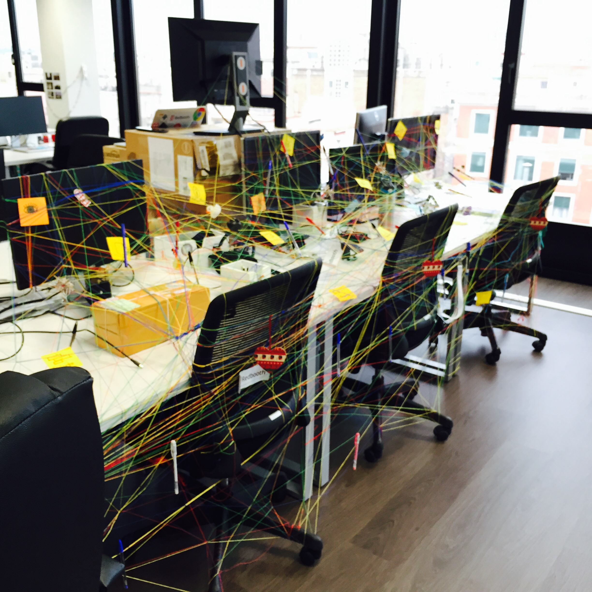

## WELCOME to

# Redbooth

#### __(there are :beer: and snacks, find them!)__

#### Tweet about the talk with the _#vipertalk_ hashtag

^ Hello and Welcome to Redbooth! I'm Sergi Gracia, iOS developer here @ Redbooth and we are very excited to hold our first iOS talk in our office.
First of all we would like to know: How many people here knows anything about Redbooth? and how many of you used Redbooth in the last year?
Before the talk about Viper and for those who don't know our company or didn't try our product recently, let me do a quick introduction about Redbooth.

---

## redbooth.com

[__Try it now!__](http://redbooth.com)

^ Redbooth is an online tool where you can collaborate (managing projects, assigning tasks, sharing files) and communicate in real-time (via video conference or chat). All these features are available for web, android and obviously for iOS devices.

---

### 2008
### Teambox
### :arrow_down:
### 2014
## Redbooth

^ Maybe some of you have heard about Teambox, Redbooth was originally founded as Teambox in 2008.

---

^ And was founded by this guy from Albacete, Pablo Villalba.

---

## 4

^ Redbooth started with 4 workers in a small flat here in Barcelona.

---

## 20

^ Then in the summer of 2012 we received an investment and moved to a small office here in Barcelona and the team grew up to 20 workers. At that time we also opened another office in San Francisco where we based our bussines team.

---

## 35

^ Then at the end of 2013 we received a new investment so we were able to move to this great office. We are near to close a new financing round so we are already buying tables to grow up again.

---

## 13

^ So right now we are 35 people here and 13 in SF. Bussiness team there and engineering team here.

---

# How is life at Redbooth?

---

^ we are a big family and as a family we love to do things together like...

---

^ offsites (work on prototypes and have fun)

---

^ build our own custom ping pong table

---

^ In fact we are right now working on the second phase, a raspberry pi and some electronic components are involved. The codename is Project Manhattan.

---

^ homemade lunchs

---

^ yoga

---

^ call of duty on fridays

---

^ trolls (by the way, this is how we found out tables when we came back from the NSSpain)

---

^ gifs

---

## Redbooth Mobile Team

^ so before start with the technical talk let me introduce the Redbooth Mobile Team. When I arrived to Redbooth, almost 2 years ago, the iOS and android apps were being developed by contractors and we decided to start building our internal mobile team.

---

^ so after some months we grew up to 3 Android developers and 3 iOS developers. During the last year and a half we had to deal with big changes in our apps, new big features and big refactors... to make that possible we had to start thinking about clean architecture because our apps became bigger and more complex. As a result nowadays we are migrating all our controllers to VIPER.

---
