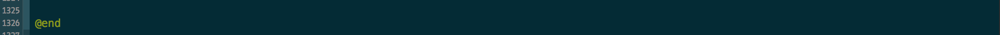

# _VIPER_
## En busca de la arquitectura perfecta
##### [_@pepibumur_](http://www.twitter.com/pepibumur)


---


# _Índice_
- Introducción: ViewControllers
- VIPER
- Routing
- Accesory Views
- Ejemplo
- Conclusiones

---


# _Índice_
- _Introducción: ViewControllers_
- VIPER
- Routing
- Accesory Views
- Ejemplo
- Conclusiones

---

## Documentación, _libros_, ejemplos, _tutoriales_
### objc.io, RayWenderlich, iOS Dev Weekly, NSHipster

---

# Patrones
## _Protocols_, _Delegates_, _Data Sources_
### _KVO_

---


---

## __Recuerda__
# Son ejemplos

^Y por lo tanto no debemos seguir al pie de la letra. Deben servir junto con la documentación como algo orientativo. Un ejemplo de código tiene sentido en términos de implementación en el contexto del ejemplo pero si lo analizas en detalle seguramente vulnere los principios de Solid 

---

## [fit] Clean Architecture
###_Independiente de frameworks, UI, database y entidades externas. Además, testeable_
[The Clean Architecture](http://blog.8thlight.com/uncle-bob/2012/08/13/the-clean-architecture.html)

---

# ViewController

---

> # [fit] A _view controller_ coordinates its efforts with _model objects_ and other controller objects—including other view controllers
-- Apple

---

- View~~Controller~~Delegator

```objectivec
@interface TBThreadDetailViewController : RBViewController <UITableViewDataSource,
 UITableViewDelegate, RBViewControllerURLProtocol, NSFetchedResultsControllerDelegate, TBObjectDetailHeaderCellDelegate,
  TBUploadCellDelegate,TBWatchersViewDelegate>
```

- Multi Responsabilidad

```objectivec
[self presentViewController:previewController animated:YES completion:nil]; //Navigation
[Task downloadNewObjectWithID:self.threadIdentifier.remoteIdentifier withSuccess:^{}]; // Networking
NSFetchRequest *request = [[NSFetchRequest alloc] initWithEntityName:[Comment entityName]]; // Data persistence
[self.view setBackgroundColor:ss_Color_White]; // Formatting
```
- Monster files




---

- Imposible de testear
- Gran acomplamiento entre componentes
- Estructura ~~infumable~~ incomprehensible

---


---


---

# Arquitectura

---

## _Arquitectura_
#### ¿Quién __persistirá__ los datos?
#### ¿Y la __interacción__ con la API?
#### ¿Debería el ViewController saber de la __navegación__?
---

### Arquitectura
# _Viper_
### View, Interactor, Presenter, Entity, and Routing
#### [obc.io - Viper](http://www.objc.io/issue-13/viper.html)
---


# _Índice_
- Introducción: ViewControllers
- _VIPER_
- Routing
- Accesory Views
- Ejemplo
- Conclusiones

---


---

### [fit] _View_
- Muestra el contenido que recibe (pasivamente) del presenter
- Notifica acciones del usuario al presenter
- Presenter desconoce de los elementos de UI de la vista
- Un _protocolo_ define la comunicación (uno para cada dirección)

---


---

### [fit] _Presenter_
- Incluye la lógica para formatear la Vista
- Obtiene la información del interactor
- Recibe _acciones_ de la vista que traduce en:
  - Acciones de navegación (wireframe)
  - Peticiones al _interactor_

---


---

### [fit] _Interactor_
- Está asociado un único __use case__ de la aplicación
- Trabaja con _PONSO_ entities

---


### _DataManager_


---


### _WireFrame_


---


